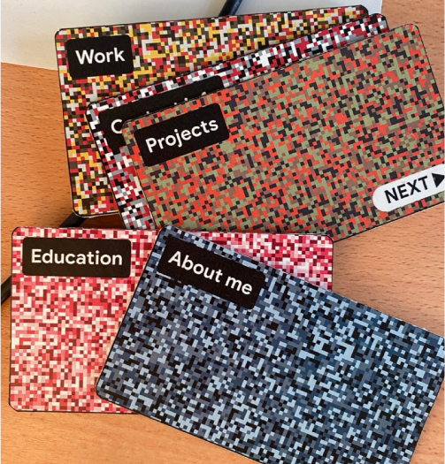

<h1 align="center">
Augmented Resume
</h1>

<h6 align="center">
An interactive, more representative way to make and share a resume
<br />
<a href="https://www.youtube.com/watch?v=XyLuapdwSIA">View Demo</a>

</h6>
<div align="center">

</div>

---

<br />

## Check out the live demo
[](http://www.youtube.com/watch?v=XyLuapdwSIA)


## Techincal Requirements
- Unity 2020.3.43f1 LTS
- Vuforia engine 12 or higher
- Vuforia Developer Key

## Installation

1. Clone the repo
   ```sh
   git clone https://github.com/OopsOverflow/AugmentedResume.git
    ```
   
2. Import the project in Unity Hub


## Usage
If you don't want to build the project, you can download the apk file from the link below and install it on your android device.
The installation process is the same as any other apk file.

